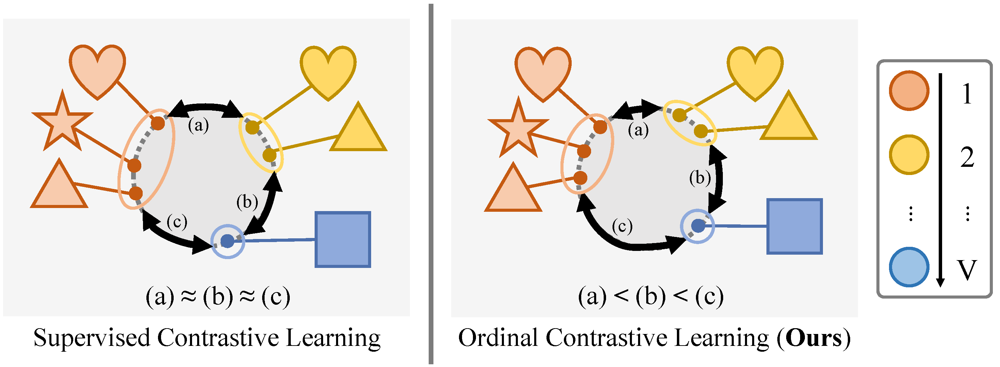

# [MICCAI'24 early accept] OCL: Ordinal Contrastive Learning for Imputating Features with Progressive Labels


- This is the official PyTorch implementation of ***Modality-Agnostic Style Transfer for Holistic Feature Imputation.*** [Arxiv]([https://arxiv.org/abs/2503.02898](https://arxiv.org/abs/2503.02899) | [Springer Link](https://link.springer.com/chapter/10.1007/978-3-031-72069-7_32)

<br/>
<p align="center"></p>

## Abstract
Accurately discriminating progressive stages of Alzheimer’s Disease (AD) is crucial for early diagnosis and prevention. It often involves multiple imaging modalities to understand the complex pathology of AD, however, acquiring a complete set of images is challenging due to high cost and burden for subjects. In the end, missing data become inevitable which lead to limited sample-size and decrease in precision in downstream analyses. To tackle this challenge, we introduce a holistic imaging feature imputation method that enables to leverage diverse imaging features while retaining all subjects. The proposed method comprises two networks: 1) An encoder to extract modality-independent embeddings and 2) A decoder to reconstruct the original measures conditioned on their imaging modalities. The encoder includes a novel ordinal contrastive loss, which aligns samples in the embedding space according to the progression of AD. We also maximize modality-wise coherence of embeddings within each subject, in conjunction with domain adversarial training algorithms, to further enhance alignment between different imaging modalities. The proposed method promotes our holistic imaging feature imputation across various modalities in the shared embedding space. In the experiments, we show that our networks deliver favorable results for statistical analysis and classification against imputation baselines with Alzheimer’s Disease Neuroimaging Initiative (ADNI) study.

## Citation
If you find our work useful for your research, please cite the our paper:
```
@inproceedings{baek2024ocl,
  title={OCL: Ordinal Contrastive Learning for Imputating Features with Progressive Labels},
  author={Baek, Seunghun and Sim, Jaeyoon and Wu, Guorong and Kim, Won Hwa},
  booktitle={International Conference on Medical Image Computing and Computer-Assisted Intervention},
  pages={334--344},
  year={2024},
  organization={Springer}
}
```
